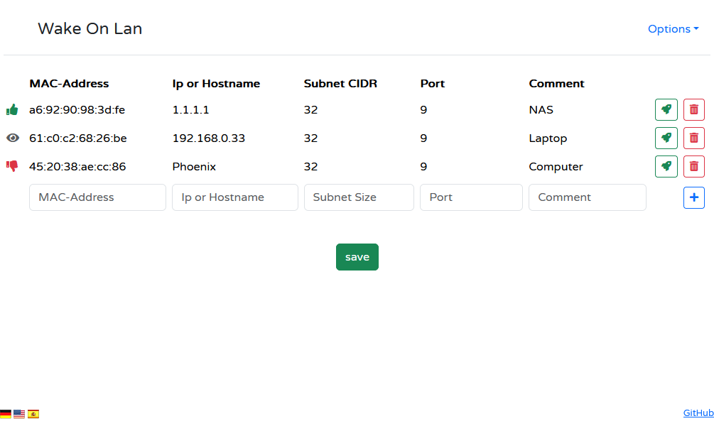

# wake-on-lan_plus
forked from AndiSHFR/wake-on-lan.php



# Changes of the 2024 wake-on-lan_plus Release
  * now works with php 8.3
  * implemented some value checks for mac-address, CIDR and port before adding new entries
  * adding a save and cancel button, when changes are made
  * renamed Tools to Options
  * small changes to the ui
  * newer bootstrap version
  * added TeamViewer to the host udp port check
  * default values for CIDR(24) and port(9) if left empty

    # docker compose
    easiest way is to clone the repository, (optionally) rename example.env to .env and adjust
    you also need to make a macvlan network, fitting your network
    
    docker network create -d macvlan \
    --subnet=192.168.1.0/24 \
    --gateway=192.168.1.1 \
    -o parent=eth0 macvlan_network

    
    docker compose up -d


# Requirements
* PHP8
* Internet connection for CDN includes (.js, .css)
* Sockets extension must be enabled
* php-mbstring needs to be installed
* Web server must be allowed to write to the file ``config.json``


# Installation
* Either clone the repository or download the zip file
* Copy the file ```wake-on-lan_plus.php``` to a directory on your web server


# Enabling the php sockets extension
The way the php sockets extension is enabled slidely differes with every php installation.

Here are basic steps for linux users:

  * Go to the directory that contains your ``php.ini``file.
  * Open the file with text editor
  * Search for the line ``;extension=sockets``
  * Remove the trailing semicolon (;) to enable this feature.
  * Save your ``php.ini``file
  * Reload your webserver configuration.


# Setup
Open your favorite browser and navigate to the ```wake-on-lan_plus.php``` url.
Now you can start adding your the hosts you want to wake.

# General Operation

## Adding a host
To add a host simply fill the edit fields at the bottom of the table and press the blue button with the plus sign.

You need to fill the follwing input fields:

  * _Mac-Address_ - Type the mac address of the host you wish to wake. The values can be separated by a dash (-) or a colon (:) - both will work.
                    If no seperator is entered, (-) is used as a seperator.
  * _IP-Address_ - Type the ip address of the host. This is required to query the "host up" state and calculate the broadcast address of the magic packet.


## Removing a host
To remove a host simply click on the trashcan icon of the host you want to remove.


## Saving the configuration
You can save the configuration by choosing _Options_ -> _Save Configuration_ or the green save button at the center of the screen.
Saving will only be available after changes are made.

The configuration will be saved to a json file in the same directory as of ```wake-on-lan_plus.php```.

The web server needs permission to write to the file. You you may need to adjust folder permission accordingly.

# Options Dropdown Menu

* _Download Configuration_ - This will download the ``config.json``file to your computer.

* _Export Configuration_ - open a modal window with the configuration as a json file. Copy the contents of the edit window and save the configuration as a file.

* _Import Configuration_ - open a modal window with a text box. Paste your configuration into the text box and click on __Import__.

* _Load Configuration_ - Load the configuration from the ``config.json``file from the web server.

* _Save Configuration_ - Save the configuration to the file ``config.json`` on the web server. Make sure the web server process is allowed to write to the file.


* _Wake up!_ - send a magic packet for the selected host.

* _Remove_ - delete the row from the configuration. The data of the deleted row is placed in the input fields for adding a new host. If you accidently removed a host you can simply press _Add_ again to add it again.
* _Add_ - adds a new entry to the table. Fill in the text boxes and press _Add_.

# License
```wake-on-lan_plus.php``` is published under [MIT](LICENSE) license.
